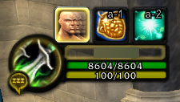

# RippysTrinketMenuFix
Fix TrinketMenu having low render priority(Strata)

to

### How to install

Should work for all versions of wow where TrinketMenu also works.
Will not work without TrinketMenu installed as it uses it as a dependancy.
If you're using a different version of wow other than 2.4.3 and don't want it to say out of date/incompatible, open the .toc file and change `## Interface: 40200` (Representing patch 4.2) to whatever version of wow you're on
For example, `##Interface: 10120` would represent patch 1.12 (vanilla)
